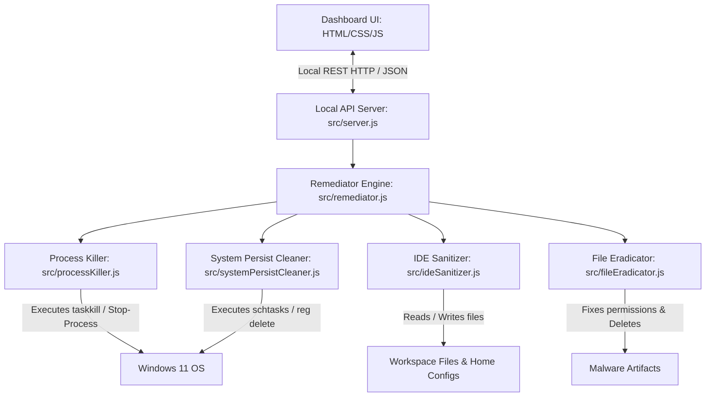

# Architecture Design Document: DevSecGuard

## 1. Overview
DevSecGuard is designed as a standalone, zero-dependency Node.js application. It consists of a backend orchestrator (the **Remediator**) and a local frontend (the **Dashboard**).

## 2. Component Breakdown

### 2.1 Backend Core Engines

#### `processKiller.js` (Process Neutralization)
* **Goal:** Terminate any active process running the wiper or polling daemon.
* **Mechanism:**
  * Runs PowerShell commands via `child_process.exec` or `execFile`:
    `powershell -Command "Get-CimInstance Win32_Process | Where-Object { $_.CommandLine -like '*gh-token-monitor*' -or $_.Name -eq 'gh-token-monitor.exe' } | Select-Object ProcessId, CommandLine"`
  * Evaluates commands matching unauthorized `bun.exe` scripts or node scripts related to `router_runtime.js`.
  * Calls `taskkill /F /PID <pid>` or PowerShell `Stop-Process -Id <pid> -Force` to immediately terminate the process.

#### `systemPersistCleaner.js` (System Persistence Removal)
* **Goal:** Clean Windows Task Scheduler and Startup Registries.
* **Mechanism:**
  * Uses native Windows shell commands:
    * `schtasks /query /fo csv /nh` to search for Tasks with name containing `gh-token-monitor`.
    * `schtasks /delete /f /tn "gh-token-monitor"` to delete found tasks.
    * `reg query HKCU\Software\Microsoft\Windows\CurrentVersion\Run` to check for startup registry links.
    * `reg delete HKCU\Software\Microsoft\Windows\CurrentVersion\Run /v "gh-token-monitor" /f` to remove them.

#### `ideSanitizer.js` (IDE Persistence Cleaning)
* **Goal:** Find and clean startup hooks in `.vscode/tasks.json` and `.claude/settings.json` or `~/.claude.json`.
* **Mechanism:**
  * Scans workspace directories recursively, ignoring `node_modules` and `.git`.
  * Checks `.vscode/tasks.json`:
    * Parses JSON content.
    * Iterates through the `tasks` array.
    * Looks for tasks with `"runOn": "folderOpen"`.
    * Inspects the command/args. If it points to suspicious paths (e.g. temporary directory scripts, setup.mjs, router_runtime, etc.), it either deletes the task or removes the `"runOn"` config.
    * Rewrites the sanitized `tasks.json` back to disk.
  * Checks `.claude.json` / `.claude/settings.json`:
    * Parses the configuration file.
    * Scans for startup scripts or event hooks.
    * Clears malicious command declarations.

#### `fileEradicator.js` (Payload Deletion)
* **Goal:** Eradicate files on disk even if they are marked read-only or hidden.
* **Mechanism:**
  * Searches `%TEMP%`, `%TMP%`, and project workspaces for files matching:
    * `router_init.js`, `router_runtime.js`, `setup.mjs`, `tanstack_runner.js`.
    * Maliciously installed local `bun.exe` (if placed outside normal installer paths).
  * If a file cannot be deleted due to permissions:
    * Executes `attrib -r -s -h <filepath>` using Windows shell to remove Read-only, System, and Hidden flags.
    * Changes local node permissions using `fs.chmodSync(filepath, 0o666)`.
    * Deletes the file via `fs.unlinkSync(filepath)`.

### 2.2 Local HTTP Server (`src/server.js`)
* **Goal:** Provide a local bridge between the HTML dashboard and the system commands.
* **Security:**
  * Binds **only** to `127.0.0.1` (localhost) to prevent external access.
  * Uses an ephemeral port (or user-defined port, default `8422`).
  * Features custom routing:
    * `GET /`: Serves `public/index.html`.
    * `GET /api/scan`: Initiates a dry-run scan and returns JSON results.
    * `POST /api/clean`: Triggers full sequential cleanup and returns execution logs.
    * `GET /public/*`: Serves static css/js files with correct Content-Type headers.
  * Serves without external frameworks (using native Node.js `http` module).

### 2.3 Dashboard UI (`public/`)
* **Goal:** Display real-time status and provide trigger actions.
* **Tech:** Single-page HTML5 with vanilla Javascript and CSS.
* **Styling:** Dark glassmorphism, responsive visual health meters, and detailed log views.
